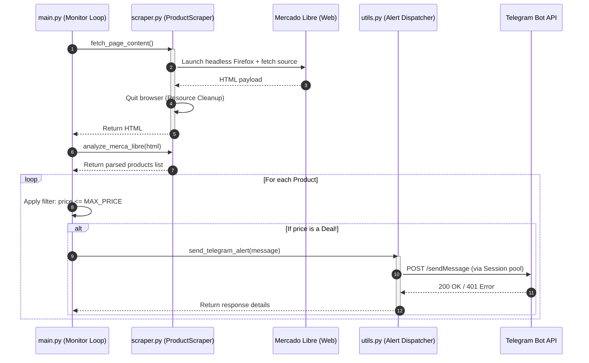

# Nintendo DS Price Tracker

[](https://python.org)
[](https://pytest.org)
[](LICENSE)

A robust, portfolio-grade automated web scraping tool designed to monitor online marketplaces for affordable Nintendo DS consoles and dispatch real-time alerts via Telegram.

---

## System Architecture

The following diagram illustrates the design workflow of the system, showcasing modular components, resource cleanups, and secure API integrations:



---

## Features

- **Automated Web Scraping**: Utilizes Selenium WebDriver running headlessly to safely bypass standard bot detection algorithms.
- **Robust Resource Lifecycle**: Strict `try...finally` blocks to guarantee browser processes are always terminated, avoiding memory and process leaks.
- **Connection Pooling**: Uses `requests.Session` for persistent TCP connection reuse when dispatching API alerts.
- **Secure by Design**: Configuration is completely decoupled from logic. Sensitivities and configurations are isolated within a `.env` file, and structured logging hides authentication tokens.
- **Automated Testing Suite**: A robust unit and integration testing suite utilizing `pytest` and `pytest-mock`.
- **Google-Style Docstrings**: Exhaustive class-level and function-level documentation matching industry guidelines.

---

## Installation & Setup

### 1. Clone the repository
```bash
git clone https://github.com/DevilHayabusa/nintendo-ds-tracker.git
cd nintendo-ds-tracker
```

### 2. Set up Virtual Environment
Create and activate the Python virtual environment:
```bash
# Create venv
python -m venv venv

# Activate venv (Linux / macOS)
source venv/bin/activate

# Activate venv (Windows)
# .\venv\Scripts\activate
```

### 3. Install Dependencies
```bash
pip install -r requirements.txt
```

### 4. Configure Environment Variables
Create a `.env` file in the root directory and add your credentials:
```ini
# Telegram Bot Configuration
TELEGRAM_TOKEN=your_telegram_bot_token
TELEGRAM_CHAT_ID=your_chat_id

# Scraper Settings
TARGET_URL=https://listado.mercadolibre.com.mx/nintendo-ds-lite
MAX_PRICE=1000.0
CHECK_INTERVAL=3600
```

> You can acquire a token by speaking to `@BotFather` on Telegram. Find your chat ID by messaging `@userinfobot`.

---

## Running the Application

To run the tracker in the background or monitor execution output directly, run:
```bash
python src/main.py
```

Sample output:
```text
2026-06-22 09:50:00,123 [INFO] src.main: Starting price monitor for: https://listado.mercadolibre.com.mx/nintendo-ds-lite (Max Price: $1000.0)
2026-06-22 09:50:00,125 [INFO] src.main: Checking for new deals...
2026-06-22 09:50:00,127 [INFO] src.scraper: Opening headless Firefox browser to: https://listado.mercadolibre.com.mx/nintendo-ds-lite
2026-06-22 09:50:07,854 [INFO] src.scraper: Successfully fetched page source.
2026-06-22 09:50:07,899 [INFO] src.scraper: Firefox WebDriver closed.
2026-06-22 09:50:07,950 [INFO] src.main: Processed 104 listings from page.
2026-06-22 09:50:07,980 [INFO] src.utils: Sending alert notification to Telegram...
2026-06-22 09:50:08,210 [INFO] src.main: Alert sent: 'Nintendo DS Lite Roja' at $850.0
2026-06-22 09:50:08,211 [INFO] src.main: Sleeping for 3600 seconds...
```

---

## Running Automated Tests

We use `pytest` for automated test suites. Running tests verifies HTML parsers and external API mock endpoints:

```bash
# Run all tests
pytest -v

# Run tests with coverage (optional, requires pytest-cov)
# pytest --cov=src tests/
```

---

## Security & Resource Policies

1. **Credentials Isolation**: The app reads parameters dynamically via `python-dotenv`. Credentials should never be committed to Git.
2. **Safe Logging**: The default logger handles network exceptions and suppresses token components from HTTP errors.
3. **RAM & CPU Conservation**: Firefox runs in headless mode and releases all subprocesses immediately inside `finally` blocks.
